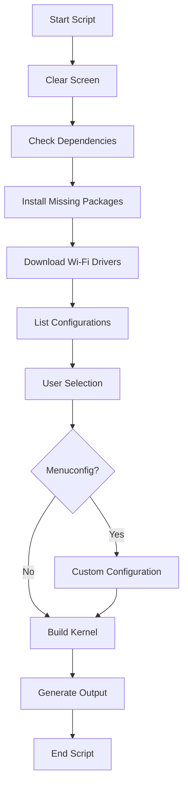

NetHunter Kernel Build Script

<p align="center">
  
  
  
</p>

📋 Table of Contents

· Overview
· ✨ Features
· ⚡ Prerequisites
· 🚀 Quick Start
· 🔧 Usage
· 📁 Script Workflow
· 📦 Output
· ⚠️ Important Notes
· 📄 License
· 🤝 Contributing
· 🔧 Support
· 🙏 Credits
· ⚠️ Disclaimer

🎯 Overview

This script automates the process of building a custom Linux kernel with full support for Kali NetHunter, the penetration testing platform for Android devices. It simplifies the compilation process, ensuring all necessary drivers, patches, and configurations are included for advanced security testing and wireless attacks.

✨ Features

· 🔧 NetHunter Integration: Full support for NetHunter tools including HID Keyboard, BadUSB, and MITM attacks
· 📡 Wi-Fi Driver Support: Drivers for popular chipsets (rtl8188eu, rtl8812au, 88x2bu) with monitor mode and packet injection
· 🔌 USB Gadget Support: USB OTG functionality for HID Keyboard and BadUSB
· 🛡️ SELinux Permissive: Unrestricted access for penetration testing
· ⚡ Performance Tweaks: Custom CPU/GPU governors and I/O schedulers
· 🔋 Battery Optimization: Power-saving features for extended sessions
· 📦 Kernel Modules: Pre-built modules for NetHunter tools

⚡ Prerequisites

System Requirements

· 💻 Linux Environment: Ubuntu, Debian, or Kali Linux
· 🔓 Unlocked Bootloader: Device must support custom kernels
· 💾 Sufficient Storage: At least 20GB free space

Dependencies Installation

```bash
sudo apt update
sudo apt install clang make git python3 flex bison bc libssl-dev \
build-essential libncurses-dev ccache automake lzop gperf zip \
curl zlib1g-dev libxml2-utils bzip2 libbz2-dev squashfs-tools \
pngcrush schedtool dpkg-dev liblz4-dev optipng maven pwgen \
libswitch-perl policycoreutils minicom libxml-sax-base-perl \
libxml-simple-perl x11proto-core-dev libx11-dev libgl1-mesa-dev \
xsltproc unzip nano python2
```

🚀 Quick Start

```bash
# Download and make executable
chmod +x build_kernel.sh

# Run the script
./build_kernel.sh
```

🔧 Usage

Step-by-Step Process

1. 📥 Download the Script
   ```bash
   wget https://raw.githubusercontent.com/your-repo/build_kernel.sh
   chmod +x build_kernel.sh
   ```
2. ▶️ Execute the Script
   ```bash
   ./build_kernel.sh
   ```
3. 🎯 Follow Interactive Prompts
   · Clear Screen: Terminal cleanup for better readability
   · 📦 Dependency Check: Automatic package verification and installation
   · 📡 Wi-Fi Drivers: Downloads drivers for monitor mode and packet injection
   · ⚙️ Kernel Configuration: Select from available configs
   · 🔧 Menuconfig (Optional): Customize kernel settings
   · 🔨 Build Process: Compilation with selected configuration
4. ⚡ Flash the Kernel
   ```bash
   # Reboot to bootloader
   adb reboot bootloader
   
   # Flash the kernel
   fastboot flash boot out/arch/arm64/boot/Image.gz-dtb
   
   # Reboot device
   fastboot reboot
   ```

📁 Script Workflow



📦 Output

· 📄 Kernel Image: out/arch/arm64/boot/Image or Image.gz-dtb
· 📦 Kernel Modules: out/modules/
· 📊 Build Logs: Detailed compilation logs for debugging

Flash Commands

```bash
# Using fastboot
fastboot flash boot out/arch/arm64/boot/Image.gz-dtb

# Using TWRP recovery
adb push out/arch/arm64/boot/Image.gz-dtb /sdcard/
# Then flash via TWRP interface
```

⚠️ Important Notes

· 💾 Backup Your Data: Always backup before flashing custom kernels
· 🔓 Unlocked Bootloader: Essential for custom kernel installation
· ⚡ Power Supply: Ensure stable power during compilation
· 🐛 Debugging: Check build logs in case of errors
· 📱 Device Compatibility: Verify kernel compatibility with your device

📄 License

This project is licensed under the MIT License. See the LICENSE file for details.

```text
MIT License
Copyright (c) 2024 NetHunter Kernel Build Script
```

🤝 Contributing

We welcome contributions! Please follow these steps:

1. 🍴 Fork the repository
2. 🌿 Create a feature branch: git checkout -b feature/amazing-feature
3. 💾 Commit your changes: git commit -m 'Add amazing feature'
4. 📤 Push to the branch: git push origin feature/amazing-feature
5. 🔀 Submit a pull request

Contribution Guidelines

· Follow existing code style
· Add comments for complex logic
· Update documentation accordingly
· Test your changes thoroughly

🔧 Support

📝 Reporting Issues

If you encounter problems:

1. Check existing issues
2. Create a new issue with:
   · Device model and Android version
   · Detailed error logs
   · Steps to reproduce

📞 Contact

· GitHub Issues: Project Issues
· Email: developer@example.com
· Documentation: Wiki

🙏 Credits

· 🎯 Kali NetHunter: Official Documentation
· 🐧 Linux Kernel: Kernel.org
· 📡 Wi-Fi Drivers: Aircrack-ng, Morrownr, and community maintainers
· 👥 Contributors: Contributors List

⚠️ Disclaimer

Warning: This script is provided "as-is" without any warranties. Use at your own risk. The developers are not responsible for any damage to your device or data. Always backup your device before proceeding.

```text
THE SOFTWARE IS PROVIDED "AS IS", WITHOUT WARRANTY OF ANY KIND, EXPRESS OR
IMPLIED, INCLUDING BUT NOT LIMITED TO THE WARRANTIES OF MERCHANTABILITY,
FITNESS FOR A PARTICULAR PURPOSE AND NONINFRINGEMENT. IN NO EVENT SHALL THE
AUTHORS OR COPYRIGHT HOLDERS BE LIABLE FOR ANY CLAIM, DAMAGES OR OTHER
LIABILITY, WHETHER IN AN ACTION OF CONTRACT, TORT OR OTHERWISE, ARISING FROM,
OUT OF OR IN CONNECTION WITH THE SOFTWARE OR THE USE OR OTHER DEALINGS IN THE
SOFTWARE.
```

---

<p align="center">
  <strong>Happy hacking with your custom NetHunter kernel! 🚀</strong>
</p>

<div align="center">

⭐ Don't forget to star the repository if you find this useful!

</div>
